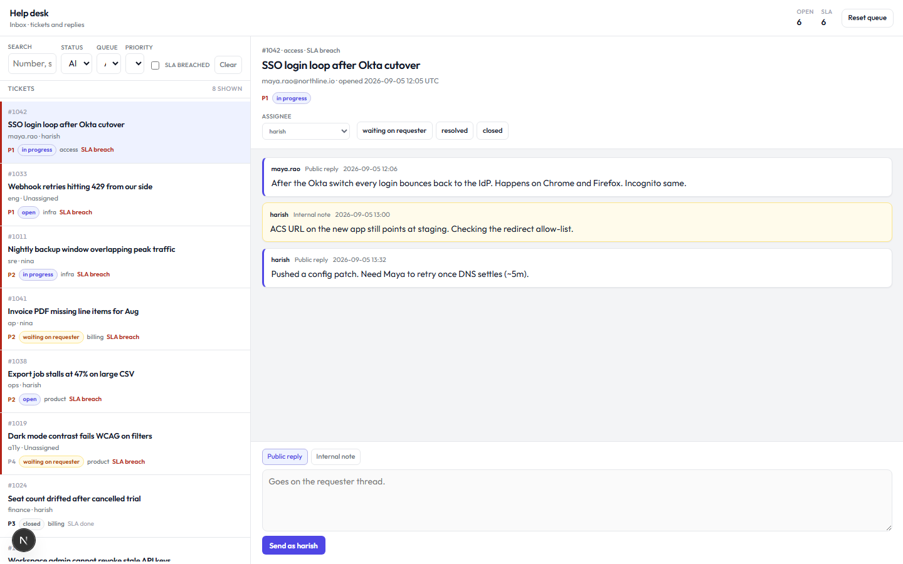

# help-desk

A spare ops console for a support queue: tickets, status moves, comments, and filters. It is not a claims system.

The chrome is a **Linear / Zendesk-style agent inbox**: ticket list, status filters, conversation pane. Light gray canvas, **Outfit**, one indigo accent. Seeded tickets cover billing, access, product, and infra — including an SLA breach so that count is real.

## Run

```bash
npm install
npm run dev
```

Open [http://localhost:3000](http://localhost:3000). You should see a two-pane inbox: tickets on the left, thread on the right. Filter by status, queue, or priority, or show SLA breaches only. Change status, reassign, and post a public reply or an internal note. **Reset queue** restores the original eight tickets (also stored in `localStorage` as `help-desk:v1`).

## Layout

```
src/domain   ticket types, status edges, SLA + filter rules
src/data     seed queue and client store
src/ui       inbox chrome, ticket list, conversation pane
app          Next.js shell, empty and fault screens
```



MIT.
