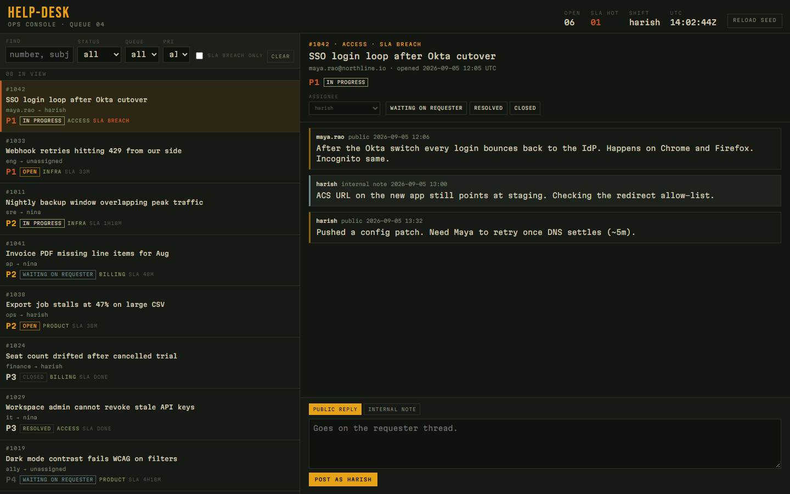

# help-desk

A spare ops console for a support queue: tickets, status moves, comments, and filters. It is not a claims system.

The board is amber on charcoal, set in **Bebas Neue** for the masthead and **Martian Mono** for everything else. Seeded tickets cover billing, access, product, and infra — including an SLA breach so the hot column is not decorative.

## Run

```bash
npm install
npm run dev
```

Open [http://localhost:3000](http://localhost:3000). You should see a two-pane console: queue on the left, thread on the right. Filter by status/queue/priority or “sla breach only”. Change status, reassign, and post a public reply or an internal note. **reload seed** in the masthead restores the original eight tickets (also stored in `localStorage` as `help-desk:v1`).

## Layout

```
src/domain   ticket types, status edges, SLA + filter rules
src/data     seed queue and client store
src/ui       console chrome, queue, thread
app          Next.js shell, empty and fault screens
```



MIT.
